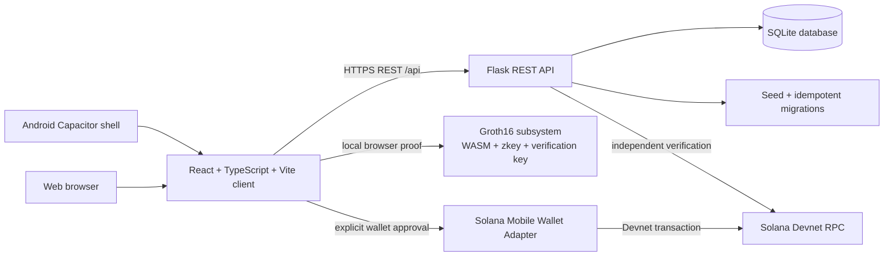

# CropCred — Economic Passport for Farmers

> **Prove what you've produced. Trade with trust. Unlock what comes next.**

CropCred is a mobile-first agricultural commerce and verification platform for the Solana Mobile CLOCK IN hackathon. It turns structured farmer activity—harvests, crop batches, marketplace orders, deliveries, payments, and credentials—into a traceable Economic Passport.

CropCred is designed for farmers, buyers, FPOs, retailers, and verification partners who need a clearer record of agricultural commerce. It does **not** claim that a database entry or a Solana transaction independently proves the physical existence, quality, or quantity of a crop.

## Table of contents

- [Product journey](#product-journey)
- [Implemented features](#implemented-features)
- [Architecture](#architecture)
- [Repository guide](#repository-guide)
- [Prerequisites](#prerequisites)
- [Local setup](#local-setup)
- [Environment variables](#environment-variables)
- [Backend API](#backend-api)
- [Production deployment](#production-deployment)
- [Android APK](#android-apk)
- [Solana Devnet integration](#solana-devnet-integration)
- [Groth16 zero-knowledge proofs](#groth16-zero-knowledge-proofs)
- [Testing and verification](#testing-and-verification)
- [Troubleshooting](#troubleshooting)
- [Security, privacy, and limitations](#security-privacy-and-limitations)
- [Hackathon demo guide](#hackathon-demo-guide)
- [Contributing and license](#contributing-and-license)

## Product journey

```text
Harvest → Crop Batch → Marketplace / B2B Demand → Order → Payment → Delivery → Economic Passport
```

A typical farmer flow is:

1. Register a harvest with crop, quantity, date, location, and expected price.
2. Create or inspect the linked crop batch and its deterministic evidence fingerprint.
3. Publish supply to the marketplace or respond to buyer demand.
4. Create an order, reserve inventory, and move the order through its lifecycle.
5. Optionally connect a compatible mobile wallet and approve a real Devnet SOL settlement.
6. Confirm delivery and update the farmer's Economic Passport and credential evidence.

The database is the application source of truth for off-chain records. Solana Devnet is used for explicit wallet-approved payment evidence; it is not a replacement for agricultural inspection or physical evidence.

## Implemented features

| Area | Current implementation |
|---|---|
| Dashboard | Database-derived harvest, sale, order, payment, delivery, credential, and activity summaries. |
| Harvests | Create, edit, view, and list harvest records. A new harvest creates a linked crop batch, evidence record, and marketplace listing. |
| Crop Batches | Linked harvest/batch records, provenance details, availability, quality status, deterministic SHA-256 fingerprint, and evidence timeline. |
| Marketplace | Stored listings, buyer preorder flow, inventory reservation, and order creation. Inventory reservation uses a conditional update to prevent overselling. |
| B2B Demand | Buyers can post structured demands; farmers can respond; a buyer can accept a response and create an existing pending-payment order. |
| Auctions | Buyers can create demands, farmers can submit bounded offers, and an award creates a pending-payment order after inventory checks. |
| Orders | Pending payment, payment processing, paid, delivery, completion, cancellation, and failure states are represented in the database. |
| Economic Passport | Aggregates verified harvests, sales, payments, deliveries, trade value, credential evidence, and activity from stored records. |
| Credentials | Economic credentials and crop-batch credentials can be viewed, shared selectively, and publicly verified through the web route. |
| CropAgent | Parses a selling intention locally, matches live marketplace/B2B records, explains the match, and requires explicit human approval before creating an order. It never signs or submits a transaction autonomously. |
| Forward Harvest | Creates a deterministic proposed-contract preview from a selected verified harvest. It is a concept preview only: no funds, token, or blockchain transaction is created. |
| Solana | Solana Mobile Wallet Adapter and Solana Web3.js support Devnet wallet connection, native SOL payment approval, confirmation, backend verification, and Devnet Explorer links. |
| Android | Capacitor Android shell with branded splash/status bar, mobile navigation, safe-area handling, back-button support, and `com.cropcred.passport` application ID. |
| Offline behavior | If the initial dashboard harvest/order request fails, the shell uses the existing explicitly labeled offline/demo workspace. It does not treat failed live requests as successful or fabricate blockchain evidence. Feature pages still report data-loading failures where live data is required. |

### Working versus untested or conceptual

- The Flask API, SQLite schema, seeded records, marketplace/order flow, demand/auction flow, credential aggregation, and browser Groth16 flow are implemented.
- The deployed API and web frontend were remotely verified on **2026-10-10**. See [Testing and verification](#testing-and-verification).
- Forward Harvest is intentionally a preview concept, not a deployed financial contract.
- Seeded agricultural records are development/demo records and must not be presented as real farmer transactions.
- A physical OPPO F9 installation, wallet handoff, and live Devnet payment approval were **not** performed in this sandbox because no physical device or compatible wallet was attached.
- The distributed APK is debug-signed. A release keystore is required for Play Store or dApp Store distribution.

## Architecture



### Frontend

The client is a React 19 / TypeScript application bundled with Vite. `client/src/services/api.ts` resolves `VITE_API_BASE_URL` (or the compatibility alias `VITE_API_URL`) and sends JSON requests to the Flask API. `client/src/App.tsx` owns the initial harvest/order loading state and the limited offline fallback.

The UI uses Wouter routes and reusable components under `client/src/components`. The main feature pages are in `client/src/pages`, including the workspace, crop batches, auctions, demand network, Economic Passport, credential verification, insights, and Innovation Lab.

### Backend

`backend/app.py` is a Flask application. `backend/wsgi.py` initializes the schema and idempotent seed data before exposing `app` for Gunicorn. Running `backend/app.py` directly also initializes the database and starts Flask on `0.0.0.0:$PORT`.

### Database

`backend/database.py` owns the SQLite path, schema, migrations, and seed data. The path is configurable through `CROP_CRED_DB_PATH`; the local default is `backend/cropcred.db`. Initialization handles additive/compatibility migrations for legacy crop-batch credentials, orders, payments, auctions, and offers. `seed_db()` uses deterministic records and avoids duplicate seeding.

### Wallet and payment layers

The frontend constructs and submits a native Devnet SOL transfer only after explicit wallet approval. The backend does not trust a client-provided signature by itself: it checks the confirmed transaction, Devnet network, payer, recipient, exact lamports, transaction status, and signature replay state before marking the order paid.

### Proof layer

The Innovation Lab fetches the current Economic Passport aggregate, uses `snarkjs` in the browser to generate a Groth16 proof from the private `sales` witness and public `threshold`, and verifies the proof with the packaged verification key. A source fingerprint is also compared during local re-verification so a proof generated from an earlier Passport state cannot silently be treated as current.

## Repository guide

```text
.
├── android/                         Capacitor Android project and Gradle build
├── backend/
│   ├── app.py                       Flask routes, CORS, payments, credentials
│   ├── database.py                  SQLite schema, migrations, seed data
│   ├── wsgi.py                      Production Gunicorn entrypoint
│   ├── requirements.txt             Flask, CORS, Gunicorn
│   ├── test_auctions.py             Auction/API tests
│   └── test_startup.py              WSGI/database startup smoke test
├── client/
│   ├── public/zk/                   Browser Groth16 WASM, zkey, verification key
│   └── src/
│       ├── components/              Shared UI and Solana wallet components
│       ├── contexts/                Wallet and application contexts
│       ├── data/                    Fallback/demo types and records
│       ├── pages/                   Product routes and feature screens
│       ├── services/api.ts          Typed API request helpers and mappers
│       └── types/                   TypeScript declarations
├── zk/
│   ├── sales_eligibility.circom     Circuit source
│   └── sales_eligibility.sym        Circuit symbols
├── capacitor.config.ts              Android app ID and WebView configuration
├── .env.example                     Local/backend/frontend variable reference
├── .env.production                  Production Vite build variables
├── DEPLOY_BACKEND.md                Deployment runbook
├── MOBILE_ANDROID.md                Android build and device checklist
├── package.json                     Frontend and mobile scripts
└── README.md                        This document
```

## Prerequisites

- Node.js compatible with the installed Vite/TypeScript toolchain; Node.js 22 was used for the verified build.
- `pnpm` 10.x. The repository declares `pnpm@10.4.1` as its package manager.
- Python 3.11 or newer.
- Android SDK, build-tools, and Java 21 for APK builds. The verified sandbox used `/home/ubuntu/android-sdk` and `/usr/lib/jvm/java-21-openjdk-amd64`.
- For wallet testing: an Android device with a compatible Solana mobile wallet and Devnet SOL.

## Local setup

### Install dependencies

```bash
git clone https://github.com/Vijayalakshmi2608/cropcred.git
cd cropcred
pnpm install
python3 -m pip install -r backend/requirements.txt
```

### Configure environment variables

For a local API and Vite development server:

```bash
cp .env.example .env
# Edit .env if your local ports or RPC settings differ.
```

The backend initializes and seeds SQLite on startup. No separate migration command is required:

```bash
export SOLANA_DEVNET_RPC_URL=https://api.devnet.solana.com
export CROP_CRED_CORS_ORIGINS=http://localhost:5173,http://127.0.0.1:5173
export CROP_CRED_DB_PATH="$PWD/backend/cropcred.db"
python3 backend/app.py
```

In a second terminal:

```bash
cd cropcred
pnpm dev
```

Open `http://localhost:5173`. The Vite development client uses `VITE_API_BASE_URL` from `.env` and should point to `http://localhost:5000/api` when the backend uses its default port.

### Type-check and build locally

```bash
pnpm check
pnpm build
```

The production build reads `.env.production` when Vite runs in production mode. Never build a physical-device APK with a localhost API URL.

## Environment variables

The authoritative local variable list is `.env.example`. Do not commit secrets.

| Variable | Used by | Purpose |
|---|---|---|
| `CROP_CRED_CORS_ORIGINS` | Flask | Comma-separated allowed browser/WebView origins. |
| `CROP_CRED_DB_PATH` | Flask | SQLite file path. Use a mounted persistent volume in production. |
| `SOLANA_DEVNET_RPC_URL` | Flask | Backend RPC endpoint; startup rejects non-Devnet hosts. |
| `VITE_API_BASE_URL` | Vite client | API base including `/api`, for example `https://cropcred-api.onrender.com/api`. |
| `VITE_API_URL` | Vite client | Compatibility alias accepted by the API service. Prefer `VITE_API_BASE_URL`. |
| `VITE_SOLANA_RPC_URL` | Vite client/wallet setup | Solana Devnet RPC configuration. |
| `VITE_APP_URL` | Vite client | Public frontend URL used by the web build. |
| `OPENROUTER_API_KEY` | Flask | Optional key for the backend's OpenRouter integrations. Never expose it to Vite or commit it. |
| `OPENROUTER_FREE_MODEL` | Flask | Optional configured model name. |
| `OPENROUTER_BEST_MODEL` | Flask | Optional configured model name. |
| `OPENROUTER_BASE_URL` | Flask | Optional OpenRouter-compatible endpoint. |

### Verified production values

The currently verified deployment uses:

```text
Frontend: https://cropcred.onrender.com
API:      https://cropcred-api.onrender.com
API base: https://cropcred-api.onrender.com/api
CORS:     https://cropcred.onrender.com,https://localhost,capacitor://localhost,http://localhost
```

The Render Free filesystem is ephemeral. The API reseeds idempotently after restart, but newly created SQLite records are not guaranteed to survive a service restart or replacement. Use a persistent mounted volume or a managed database before treating this as a durable production system.

## Backend API

All application endpoints are under `/api` and generally return:

```json
{"success": true, "data": {}}
```

Errors use:

```json
{"success": false, "error": "message"}
```

### Health check

```bash
curl -i https://cropcred-api.onrender.com/api/health
```

The health payload includes `status`, `database`, `seeded`, and `counts` for core tables. A healthy response has `status: "ok"` and `database: "ready"`.

### Route inventory

| Resource | Routes |
|---|---|
| Health | `GET /health` |
| Farmers | `GET /farmers`, `GET /farmers/:id`, `POST /farmers`, `PUT /farmers/:id/wallet` |
| Harvests | `GET /harvests`, `GET /harvests/:id`, `POST /harvests`, `PUT /harvests/:id` |
| Crop batches | `GET /crop-batches`, `GET /crop-batches/:id`, `POST /crop-batches`, `GET/POST /crop-batches/:id/credential` |
| Marketplace | `GET /marketplace`, `GET /marketplace/:id` |
| B2B demand | `GET/POST /demands`, `GET /demands/:id`, `POST /demands/:id/respond`, `GET /demands/:id/responses`, `POST /demands/:id/accept/:response_id` |
| Auctions | `GET/POST /auctions`, `GET /auctions/:id`, `POST /auctions/:id/offers`, `GET /auctions/:id/offers`, `POST /auctions/:id/award` |
| Orders | `GET /orders`, `GET /orders/:id`, `POST /orders`, `PUT /orders/:id/status`, `POST /orders/:id/cancel-payment` |
| Delivery | `POST /deliveries/:order_id/confirm` |
| Payments | `POST /orders/:id/payment-intent`, `POST /orders/:id/verify-payment`, `GET /orders/:id/payment` |
| Passport | `GET /farmers/:id/passport`, `/passport/activity`, `/passport/evidence`, `/economic-credential` |
| Credentials | `GET /credentials/:id`, `POST /credentials/:id/share` |
| Intelligence | `GET /market-intelligence`, `/insights/overview`, `/insights/product-funnel`, `/insights/commerce`, `/insights/b2b`, `/insights/credentials` |
| Validation records | `GET/POST /validation/interviews`, `/product-learnings`, `/pilots`, `/gtm-experiments`, `/founder-notes`, `/credential-verification-events` |

The route prefix in the table is `/api`; for example, the full health path is `/api/health`.

### Production WSGI startup

Gunicorn should import `backend/wsgi.py`, not only `app.py`, so initialization and idempotent seeding run before requests are accepted:

```bash
gunicorn --chdir backend wsgi:app --bind 0.0.0.0:${PORT:-5000}
```

Required production settings include:

```text
CROP_CRED_DB_PATH=/mounted/volume/cropcred.db
CROP_CRED_CORS_ORIGINS=https://cropcred.onrender.com,https://localhost,capacitor://localhost,http://localhost
SOLANA_DEVNET_RPC_URL=https://api.devnet.solana.com
```

## Production deployment

### Current verified Render deployment

The following public services were verified remotely on **2026-10-10**:

- Frontend: `https://cropcred.onrender.com`
- API: `https://cropcred-api.onrender.com`
- Health: `https://cropcred-api.onrender.com/api/health`

The frontend bundle contains `https://cropcred-api.onrender.com/api`, web CORS allows `https://cropcred.onrender.com`, Android CORS allows `https://localhost`, and seeded endpoint counts were returned successfully.

### Render configuration

For the **backend service**:

- Build command: `python3 -m pip install -r backend/requirements.txt`
- Start command: `gunicorn --chdir backend wsgi:app --bind 0.0.0.0:$PORT`
- Set `CROP_CRED_CORS_ORIGINS` to:

```text
https://cropcred.onrender.com,https://localhost,capacitor://localhost,http://localhost
```

- Set `CROP_CRED_DB_PATH` to a path on a persistent mounted disk if durable SQLite is required.
- Set `SOLANA_DEVNET_RPC_URL=https://api.devnet.solana.com`.
- Configure any optional OpenRouter variables only on the backend.

For the **frontend service**:

```text
VITE_API_BASE_URL=https://cropcred-api.onrender.com/api
VITE_SOLANA_RPC_URL=https://api.devnet.solana.com
VITE_APP_URL=https://cropcred.onrender.com
```

After saving variables, rebuild and deploy the frontend. After changing backend CORS or database settings, redeploy the API and check its logs.

### Persistent storage warning

A temporary sandbox URL is not a production API: it can expire or disappear. Render Free also does not provide durable local SQLite storage. For persistent SQLite, use a hosting plan with a mounted persistent disk and set `CROP_CRED_DB_PATH` inside that mount, or move the database layer to a managed persistent database after adapting the repository's SQLite queries. Do not claim durable production persistence while using an ephemeral filesystem.

### Remote checks

```bash
curl -fsS https://cropcred-api.onrender.com/api/health
curl -i -X OPTIONS https://cropcred-api.onrender.com/api/harvests \
  -H 'Origin: https://cropcred.onrender.com' \
  -H 'Access-Control-Request-Method: GET'
curl -i -X OPTIONS https://cropcred-api.onrender.com/api/harvests \
  -H 'Origin: https://localhost' \
  -H 'Access-Control-Request-Method: GET'
```

## Android APK

### Configuration

`capacitor.config.ts` defines:

```text
appId: com.cropcred.passport
appName: CropCred
webDir: dist/public
androidScheme: https
cleartext: false
```

Android requires the bundled Vite build to contain a publicly reachable HTTPS API. Do not package `localhost`, `127.0.0.1`, `10.0.2.2`, a development IP, or a temporary sandbox hostname into a physical-device build.

### Build and synchronize

```bash
export JAVA_HOME=/usr/lib/jvm/java-21-openjdk-amd64
export ANDROID_HOME=/home/ubuntu/android-sdk
export ANDROID_SDK_ROOT=/home/ubuntu/android-sdk
export PATH="$JAVA_HOME/bin:$ANDROID_HOME/cmdline-tools/latest/bin:$ANDROID_HOME/platform-tools:$PATH"

pnpm mobile:sync
pnpm mobile:apk
```

The debug APK is written to:

```text
android/app/build/outputs/apk/debug/app-debug.apk
```

Convenience scripts:

```bash
pnpm mobile:sync   # production web build + Capacitor sync
pnpm mobile:apk    # sync + Gradle assembleDebug
pnpm mobile:open   # open the native project in Android Studio
```

### Install and inspect

```bash
adb devices -l
adb install -r android/app/build/outputs/apk/debug/app-debug.apk
adb logcat | grep -i -E 'CropCred|Capacitor|chromium'
adb uninstall com.cropcred.passport
```

The manifest requests `android.permission.INTERNET`. The project uses Android min SDK 24, compile SDK 36, target SDK 36, and version name `1.0`. The debug artifact is signed with the debug keystore and is not a Play Store release artifact.

### Official published APK

The currently published release asset was downloaded and verified against the locally built Render-connected APK:

[Download Android APK](https://github.com/Vijayalakshmi2608/cropcred/releases/download/v1.0.0-clock-in/CropCred-final-audited-debug.apk)

Verified SHA-256:

```text
486054e912215654a215c03a73f62fdbbca61a0d6a8dc063447f2e908a47ac4d
```

This is the `v1.0.0-clock-in` release asset. A later local build must not be called the latest published build until the release asset is replaced and reverified.

## Solana Devnet integration

CropCred is Devnet-only. The frontend and backend reject a non-Devnet RPC configuration. Devnet SOL has no real monetary value.

### Wallet flow

1. Install Phantom or another compatible Solana mobile wallet.
2. Switch the wallet to Solana Devnet and obtain test SOL from the [Solana faucet](https://faucet.solana.com/).
3. Connect the wallet from CropCred.
4. Create or select an order.
5. Request a payment intent; the backend returns the recipient and a small Devnet SOL amount.
6. Approve the native SOL transfer in the wallet.
7. The client sends the real signature to `/api/orders/:id/verify-payment`.
8. The backend independently fetches the confirmed transaction and checks the payer, recipient, exact lamports, Devnet network, confirmation status, and replay state.
9. A verified transaction is linked to the Devnet Solana Explorer and reflected in payment, credential, and Passport evidence.

No private key or seed phrase is requested, stored, or transmitted by CropCred. Guided/demo mode does not open a wallet, create a signature, mark an order paid, or fabricate an Explorer link.

### Common wallet limits

- A wallet must support the Solana Mobile Wallet Adapter flow.
- A wallet on mainnet or another cluster is rejected.
- The account needs Devnet SOL for the requested transfer and network fee.
- Wallet rejection, missing wallet, account changes, and wrong-network states remain user-visible and are not treated as successful payments.
- No real-money payment or physical-device wallet settlement has been claimed as tested in this environment.

## Groth16 zero-knowledge proofs

The circuit source is `zk/sales_eligibility.circom`. Browser assets are packaged under `client/public/zk/`:

- `sales_eligibility.wasm`
- `sales_eligibility_final.zkey`
- `verification_key.json`

The Innovation Lab obtains an Economic Passport aggregate and generates a Groth16 proof with `snarkjs` using:

```text
private witness: sales
public input:    threshold
```

The proof result exposes an eligibility result and proof identifier, not individual buyer names, prices, dates, wallet addresses, or transaction records. The browser verifies the proof using the packaged verification key. It also compares a SHA-256 source fingerprint against the current Passport snapshot to reject stale local proof state.

The circuit and key are part of the repository's development/demo ceremony. They are not an independent security audit, and the repository does not claim production-grade trusted-setup assurances. A proof proves the encoded circuit statement about the supplied witness; it does not prove that the underlying off-chain agricultural records are physically true. Keep the zkey and ceremony provenance under controlled release management for production use.

### Proof test procedure

Run the application, open **Innovation Lab**, load the Economic Passport, choose a proof condition, click **Generate private proof**, and then click **Verify proof locally**. Expected behavior is a Groth16 proof result followed by the message that the proof matches current Passport data. Modify the underlying Passport data or use a stale proof and verification should fail.

## Testing and verification

### Local checks

```bash
pnpm check
pnpm build
git diff --check
python3 -m py_compile backend/app.py backend/database.py backend/wsgi.py backend/test_startup.py
CROP_CRED_DB_PATH=/tmp/cropcred-test.db \
  PYTHONPATH=backend python3 -m unittest discover -s backend -p 'test_*.py' -v
```

The backend test suite covers startup/database behavior and auction-related flows. The database initialization is intended to be idempotent; use a fresh temporary path when testing migrations.

### Representative API flow

Use the seeded records returned by the API and exercise:

```text
POST /api/harvests
→ linked crop batch and marketplace listing
→ POST /api/orders
→ marketplace quantity and linked batch quantity decrease
→ GET /api/farmers/farmer-01/passport
```

Also exercise:

```text
POST /api/demands/:id/respond
→ POST /api/demands/:id/accept/:response_id
```

and:

```text
POST /api/auctions/:id/offers
→ POST /api/auctions/:id/award
→ existing PENDING_PAYMENT order
```

The backend rejects offers or awards that exceed the demand or available inventory.

### Verified remotely on 2026-10-10

| Check | Result |
|---|---|
| Frontend HTTPS response | Passed |
| Frontend bundle contains Render API URL | Passed |
| API `/api/health` | Passed; database ready and seeded |
| Seeded farmers, harvests, batches, listings, demands, auctions, orders | Passed |
| Web CORS for `https://cropcred.onrender.com` | Passed |
| Android CORS for `https://localhost` | Passed |
| Harvest → listing → order → inventory reduction | Passed in the preceding remote API smoke flow |
| Public APK HTTP download | Passed; HTTP 200 |
| Public APK ZIP integrity | Passed |
| Public APK checksum | Passed; `486054e912215654a215c03a73f62fdbbca61a0d6a8dc063447f2e908a47ac4d` |
| Physical OPPO F9 install and wallet settlement | Not run; device was not attached |

## Troubleshooting

### “CropCred API could not be reached.”

1. Open the API health URL in a browser or run `curl`.
2. Confirm the APK/web bundle uses `https://cropcred-api.onrender.com/api` or another stable HTTPS API.
3. Check the Render API logs and service sleep/restart state.
4. Check that `CROP_CRED_CORS_ORIGINS` includes the exact origin, including scheme and port where applicable.
5. Do not replace a failed request with fabricated live data. The limited dashboard fallback is explicitly offline/demo data.

### Empty marketplace or B2B results

- Check `/api/marketplace` and `/api/demands` directly.
- Check `/api/health` counts and database readiness.
- Confirm the backend started through `wsgi.py` or called `init_db()` and `seed_db()`.
- On an ephemeral host, a restart may recreate the seeded baseline; configure persistent storage for durable records.

### SQLite initialization or persistence failure

- Verify the parent directory of `CROP_CRED_DB_PATH` exists and is writable.
- Use an absolute path on a mounted volume in production.
- Inspect startup logs for migration errors.
- Do not use a temporary sandbox path as a permanent database location.

### CORS, HTTPS, or wrong API URL

- Frontend Render service: `VITE_API_BASE_URL=https://cropcred-api.onrender.com/api`.
- Backend Render service: `CROP_CRED_CORS_ORIGINS=https://cropcred.onrender.com,https://localhost,capacitor://localhost,http://localhost`.
- Redeploy after changing Vite variables; they are embedded at build time.
- Redeploy the backend after changing CORS variables.
- Never use `localhost` for a physical Android production APK.

### Wallet does not open or payment is rejected

- Install a compatible mobile wallet and keep it on Solana Devnet.
- Fund the wallet with Devnet SOL and retry.
- Check that the account shown by the wallet matches the payer sent to the backend.
- If the transaction is rejected, the order must remain unpaid; do not manually mark it paid.
- Inspect the Devnet Explorer signature and backend logs.

### Groth16 proof fails

- Confirm all three files under `client/public/zk/` are present and served at `/zk/`.
- Rebuild the frontend after changing proof assets.
- Check browser console/network errors for the WASM or zkey.
- Generate a new proof after Passport data changes; stale fingerprints are intentionally rejected.
- A proof failure should remain visible as a proof error, not be represented as a valid credential.

### Android build or installation fails

- Check `JAVA_HOME`, `ANDROID_HOME`, SDK platform 36, and build-tools.
- Run `pnpm mobile:sync` before Gradle.
- Use `adb install -r` with USB debugging enabled.
- Check `adb logcat` for WebView/API errors.
- Verify that the build's bundled API URL is HTTPS and publicly reachable.

## Security, privacy, and limitations

- Wallet public addresses and transaction signatures are handled as payment evidence; seed phrases and private keys are never requested or stored.
- Passport records are off-chain SQLite data. A Solana transaction is a separate evidence layer.
- The backend checks Devnet transactions independently and protects against reusing a verified signature for another order.
- INR commerce values and Devnet SOL settlement amounts are separate concepts.
- Physical crop quality, quantity, existence, and delivery are not independently proven by a database record, fingerprint, credential, or transaction.
- Seed data is for development/demo use and must not be presented as real farmer activity.
- The API currently has no full user authentication/authorization layer. Before production use, add identity, tenant isolation, rate limiting, audit controls, secret management, backups, monitoring, and a durable database/volume.
- SQLite requires a single-writer/persistence strategy appropriate to the host. Render Free's ephemeral filesystem is not a durable production database.
- The distributed artifact is debug-signed and should not be treated as a store-ready release.
- The Groth16 ceremony and circuit have not received an independent security audit.

## Hackathon demo guide

A concise 90-second sequence:

1. **Dashboard:** show stored harvest, order, and economic activity metrics.
2. **Harvest:** create a harvest and show the linked Crop Batch and marketplace record.
3. **Passport:** open the Economic Passport and inspect the evidence timeline/fingerprint.
4. **Private proof:** open Innovation Lab, generate a Groth16 proof, and verify it locally.
5. **CropAgent:** enter a selling intention, inspect live matches, select an offer, and explicitly approve order creation.
6. **Buyer flow:** open Marketplace or B2B Demand, respond/accept, and show inventory/order updates.
7. **Solana:** only if a compatible wallet and Devnet SOL are available, approve the real Devnet payment and show backend verification plus Explorer link.
8. **Forward Harvest:** create a proposed preview and explain that it moves no funds and is not a deployed smart contract.

Mark the physical-device and wallet steps as unverified unless they were actually completed on the target device.

## Contributing and license

1. Create a branch for your change.
2. Keep secrets, wallet keys, production database files, and local APKs out of commits.
3. Run `pnpm check`, `pnpm build`, Python compilation, and the backend tests before opening a pull request.
4. Document API/schema changes and update this README when setup or security boundaries change.
5. Preserve Devnet-only guards and never fabricate payment signatures, balances, or confirmations.

`package.json` declares the project license as **MIT**. No root `LICENSE` file was present when this README was created; add the actual MIT license text before relying on the repository metadata as a formal license grant.

## Current release and source

- Repository: https://github.com/Vijayalakshmi2608/cropcred
- Verified source branch: `main`
- Latest configuration commit at the time of this README update: `a468c14`
- Frontend: https://cropcred.onrender.com
- API health: https://cropcred-api.onrender.com/api/health
- Android APK: [CropCred-final-audited-debug.apk](https://github.com/Vijayalakshmi2608/cropcred/releases/download/v1.0.0-clock-in/CropCred-final-audited-debug.apk)
